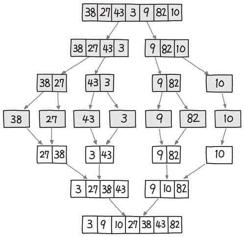
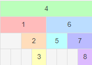

# Sort

## 0. 목차

1. [개요](#1-개요)
2. [정렬과 이진 탐색](#2-정렬과-이진-탐색)
3. [대표적인 종류](#3-대표적인-종류)
   1. [$O(n^2)$](#31-on2)
      1. [버블 정렬](#311-버블-정렬bubble-sort)
      2. [선택 정렬](#312-선택-정렬selection-sort)
      3. [삽입 정렬](#313-삽입-정렬insertion-sort)
   2. [$O(n \log n)$](#32-on-log-n)
      1. [병합 정렬](#321-병합-정렬-merge-sort)
      2. [힙 정렬](#322-힙-정렬-heap-sort)
      3. [퀵 정렬](#323-퀵-정렬-quick-sort)
      4. [트리 정렬](#324-트리-정렬-tree-sort)
4. [그 외의 정렬들](#4-그-외의-정렬들)
5. [Python의 경우](#5-python의-경우)

## 1. 개요

정렬은 숫자, 문자(아스키 코드를 기준), 키 값을 기준으로 오름차순 혹은 내림차순으로 순서대로 나열하는 작업이다.
컴퓨터 작업에서 정렬은 대부분의 문제에서 필수적인데 이를 얼마나 효율적으로 해결하는가가 정렬 문제의 핵심이다.

데이터 정렬이 꼭 필요한 이유는 데이터를 탐색하기 위해서이다. 데이터가 정렬되어있지 않다면 순차탐색을 제외한 어떤 방법도 사용할 수 없다.
그러나 정렬이 되어있다면 이진 탐색을 사용하여 효율적으로 데이터를 찾을 수 있다.
삽입과 삭제가 자주 되는 자료의 경우 정렬에 더 많은 시간이 들어가므로 순차 탐색이나 해쉬탐색을 사용하기도 한다.
허나 대부분의 경우 삽입/삭제보다는 데이터를 조회하기에 정렬을 필요로 한다.

## 2. 정렬과 이진 탐색

정렬이 필요한 이유 중 큰 이유가 이진 탐색이다.
이진 탐색은 간단하게 현재 중간에 있는 값보다 찾고자 하는 값이 작다면 왼쪽만 탐색하는 방법이다.
이 방법은 아무리 최악의 경우라도 $\log n$의 성능을 보인다.
예를 들어 43억개의 정렬된 자료가 있따면 최악의 경우에도 32회면 값을 찾을 수 있다.

이렇듯 이진 탐색은 데이터를 조회하는데 핵심인 알고리즘이며 이를 위해 효율적인 정렬은 꼭 필요하다.

## 3. 대표적인 종류

### 3.1 $O(n^2)$

#### 3.1.1 버블 정렬(Bubble sort)


버블 정렬을 앞에 있는 1, 2번 원소부터 비교하고 정렬하는 것을 $n - 1$, $n$번째 원소까지 반복하여 정렬한 뒤 다시 처음으로 돌아가 이번엔 $n - 2$와 $n - 1$번째 까지 정렬해서 최대 ${n(n - 1)}\over{2}$번 정렬한다. 한 번 돌 때마다 마지막 하나가 정렬되는 것이 거품이 올라오는 것 같다고 하여 거품 정렬이다.

정렬이 되어있는 상태가 아닌 대부분의 경우는 최악의 성능을 보이기 때문에 거의 사용하지 않는다. 그 대신 직관적이고 만들기가 쉬워서 정렬 알고리즘의 예시로 많이 보여준다.

```
def bubble_sort(lst: list, len: int):
    for i in range(len - 1, 0, -1):
        for j in range(i):
        	if a[j] > a[j + 1]:
        		tmp = a[j]
        		a[j] = a[j + 1]
        		a[j + 1] = tmp
```

#### 3.1.2 선택 정렬(Selection sort)


선택 정렬은 처음부터 끝까지 확인하고 가장 작은 것을 첫 번째로 옮긴 뒤, 두 번째에서 끝까지 확인하고 그 다음 작은 것을 두 번째로 놓아서 $n - 1$번 반복하는 방법이다. 어떻게 정렬되어있든지 일관성있게 ${n(n - 1)}\over{2}$에 비례하는 시간이 걸린다. 또한 버블정렬보다 두 배정도 빠르다.

#### 3.1.3 삽입 정렬(Insertion sort)


삽입 정렬은 k번째 원소를 1부터 k - 1까지와 비교하여 적절한 위치에 삽입하고 그 뒤의 자료를 한 칸씩 뒤로 밀어내는 방식의 정렬이다. 평균적으론 $O(n^2)$중 빠른 편이지만 자료구조에 따라 뒤로 밀어내는데 걸리는 시간이 큰 경우나 정렬하고자 하는 순서와 다르게 정렬되어 있다면 매우 오래 걸린다.

그 대신 배열이 작거나 이미 정렬된 자료구조에서 새로운 자료를 삽입/제거하는 경우엔 상당히 효율적이다. 또한 구현이 매우 쉽다는 장점도 있다.

### 3.2 $ O(n \log n) $

병합, 힙, 퀵 정렬은 평균적으로 $O(n \log n)$의 성능을 가진다. 최악의 상황에서보 병합, 힙 정렬은 $O(n \log n)$의 성능을 보이지만 퀵 정렬은 $O(n^2)$의 성능으로 안 좋아진다. 그러나 퀵 정렬은 평균적으로 세 개의 정렬 중 가장 빨라서 이를 조금 개량하여 최악의 경우가 거의 발생하지 않도록 코드를 짜서 사용한다. (힙정렬로 변환하는 등의 방법으로)

#### 3.2.1 병합 정렬(Merge sort)


병합 정렬은 원소 개수가 1개 또는 0개가 될 때까지 두 부분으로 쪼개고 자른 순서의 역순으로 크기를 비교하며 병합해 나가는 방식의 정렬이다. 병합된 부분은 이미 정렬이 되어있기에 다시 비교하지 않아도 된다. 이는 대표적인 분할 정복 알고리즘이다.



성능은 퀵 정렬보다 전반적으로 떨어지고 데이터 크기만한 메모리가 더 필요하다는 단점이 있다. 그러나 데이터의 상태에 별 영향을 받지 않는다는 큰 장점이 있다. 이는 동일한 값이 있을 때에 기존 기준의 정렬순서가 유지되지 않을 수도 있는 힙, 퀵 정렬과 차별점을 두는 병합 정렬만의 장점이다.

#### 3.2.2 힙 정렬(Heap sort)


힙 정렬은 다음과 같은 과정을 통해 정렬하는 방법이다.

1. 원소들을 전부 힙에 삽입한다.
2. 힙의 루트에 있는 값은 남은 수들 중에 최솟값(혹은 최댓값)을 가지므로 루트를 출력하고 힙에서 제거한다.
3. 힙이 빌 때까지 2의 과정을 반복한다.

선택 정렬과 거의 동일하며 가장 큰 원소를 뒤로 보낼 때, 하나씩 다 확인하느냐 힙으로 확인하느냐의 차이만 있다. 힙정렬은 추가적인 메모리가 전혀 필요하지 않으며 항상 $O(n \log n)$의 성능을 발휘하는 장점이 있다.

#### 3.2.3 퀵 정렬(Quick sort)


퀵 정렬은 컴퓨터로 가장 많이 구현된 정렬 알고리즘 중 하나로 평균적인 상황에서 최고의 성능을 나타내는 정렬 방법이다.

방식은 적절한 피벗(원소 하나)을 정하고 피벗보다 작은 것은 앞으로 빼내고 그 뒤에 피벗을 옮겨 피벗보다 작은 것과 큰 것으로 나눈다. 그리고 각각에서 다시 피벗을 잡고 정렬해서 각각의 크기가 0 또는 1이 될 때까지 정렬하는 방식이다. 이렇게 피벗을 잡고 이보다 작은 원소들을 왼쪽으로, 보다 큰 원소들을 오른쪽으로 나누는걸 partition step이라고 하는데 퀵 정렬에서 이 방식을 어떻게 구현하느냐에 따라 성능이 많이 차이날 수 있다.


퀵 정렬의 가장 간단한 분할 알고리즘인 로모투 파티션을 도식화한 그림이다. 피벗은 가장 오른쪽 값을 기준으로 선택하고 이를 기준으로 2개의 포인터가 이동해서 오른쪽 포인터의 값이 피벗보다 작다면 서로 스왑하는 형태로 진행된다. left, right가 한 번 돈 결과를 보면 피벗은 중앙으로 이동하고 왼쪽은 피벗보다 작은 값, 오른쪽은 피벗보다 큰 값으로 분할된 것을 볼 수 있다. 이렇게 계속 분할하면서 left < right를 만족하지 않을 때까지 재귀로 반복하면 정렬이 끝난다.

만약 피벗을 최솟값이나 최댓값으로 계속해서 잡게된다면 최악의 경우인 $O(n^2)$의 성능을 가진다. 이는 힙 정렬이나 병합 정렬과 다른 퀵 정렬의 단점이다. 이를 방지하기 위해 피벗을 랜덤으로 잡는 것, 무조건 배열의 위치상 중간에 있는 값을 피벗으로 설정하는 것, 배열 중에 3개나 9개의 원소를 골라 이들의 중앙값을 피벗으로 잡는 것 등 여러 방법이 있다. 이 방법들을 사용해도 최악의 경우는 나올 수 있으나 그 경우가 극히 드물어진다. 또한 배열이 단순한 비교가 불가한 것이라면 중앙값을 찾는 과정 역시 오래 걸릴 수 있으므로 이럴 땐, 무작위 값이나 중간에 있는 값을 피벗으로 잡는 것이 좋다.

피벗을 랜덤으로 잡아도 최악의 경우를 모두 피할 수 있진 않기에 이를 보완하기 위해 특수한 상황이 나왔을 때, 다른 빠른 정렬 알고리즘을 섞어서 쓰는 하이브리드 퀵 소트도 많이 사용한다. 예를 들어 재귀 깊이가 일정 이상으로 깊어지면 힙 정렬 알고리즘을 사용하여 항상 $O(n \log n)$을 보장하는 방법 등이 있다.

파이썬은 퀵 정렬은 사용하지 않는데 퀵 정렬이 불안정 정렬이기 때문이다. 파이썬은 항상 안정(stable) 정렬을 사용한다.

#### 3.2.4 트리 정렬(Tree sort)

트리 정렬은 이진 탐색 트리를 만들어 정렬하는 방식이다. 힙 정렬과의 차이는 정렬될 자료의 각 원소 크기에 따라 부모 노드의 왼쪽 자식이 되느냐, 오른쪽 자식이 되느냐가 갈린다는 점이다.

대략적인 진행은 다음과 같다.

1. 정렬된 배열의 맨 첫 값이 루트 노드가 된다.
2. 다음 값부터는 기존 노드 값과 비교한다. 루트 노드부터 출발하여 추가될 노드 값이 기존 노드 값보다 작은 경우는 왼쪽 자식을, 기존 노드 값보다 크거나 같을 경우는 오른쪽 자식을 찾는다. 내림차순이라면 반대로 기존 노드 값보다 크면 왼쪽, 작거나 같으면 오른쪽을 찾으면 된다.
3. 2번 과정에서 해당 방향의 자식 노드가 없으면 그 방향의 자식 노드로 추가한다. 있으면 그 방향의 자식 노드로 가서 크기를 비교하고 자식 노드가 있으면 2번 과정과 같은 방법으로 계속 해당 방향으로 이동하여 조사하고 없으면 그 방향의 자식 노드로 추가한다.
4. 모든 값이 노드로 추가되었으면 해당 트리를 중위 순회 방식(왼쪽 자식 - 자신 - 오른쪽 자식)으로 순회하여 그 순서대로 값을 정렬한다.

예를 들어 [4, 6, 1, 7, 5, 8, 2, 3]을 트리 정렬로 정렬하면 아래와 같은 그림으로 정렬된다. 또한 이를 중위 순회 방식으로 순회하면 무지개색 순으로 순회한다.



## 4. 그 외의 정렬들

그 외의 두 가지 이상의 정렬 방법을 합친 하이브리드 정렬들, 특수한 상황에서 $O(n)$의 성능을 가지는 정렬 등 다양한 정렬들이 있다. 이에 대해선 [이곳](https://namu.wiki/w/%EC%A0%95%EB%A0%AC%20%EC%95%8C%EA%B3%A0%EB%A6%AC%EC%A6%98#s-2.3) 을 참고하면 된다.

## 5. Python의 경우

python은 sort()(주어진 리스트를 정렬)와 sorted()(정렬된 새로운 리스트를 생성)라는 내장 정렬 함수가 있다. 두 개 모두 stable 정렬이며 다양한 옵션으로 원하는 정렬을 할 수 있다.

기본적으로 sort() 함수(sorted()도 동일)는 오름차순으로 정렬한다. 또한 이중 리스트를 정렬한다면 그 안의 값 중 가장 앞의 원소를 우선적으로 오름차순 정렬한다.

```
>>> a = [5, 4, 3, 2, 1]
>>> a.sort()
>>> a
[1, 2, 3, 4, 5]

>>> b = [[5, 2], [1, 3], [2, 20]]
>>> b.sort()
>>> b
[[1, 3], [2, 20], [5, 2]]
```

만약 내림차순을 원한다면 옵션으로 reverse=True를 설정하면 된다.

```
>>> a = [1, 2, 3, 4, 5]
>>> a.sort(reverse=True)
>>> a
[5, 4, 3, 2, 1]
```

만약 이중 리스트에서 앞 원소는 내림차순, 뒤 원소는 오름차순으로 정렬하고 싶다면 key 옵션을 이용하면 된다.

```
>>> a = [(6, 10), (2, 3), (4, 5), (1, 7), (6, 8), (9, 10)]
>>> a.sort(key=lambda x: (-x[0], x[1]))
>>> a
[(9, 10), (6, 8), (6, 10), (4, 5), (2, 3), (1, 7)]
```

문자열을 정렬하면 아스키 코드 값으로 정렬된다.

```
>>> word = ["ab", "efw", "a", "ee"]
>>> word.sort()
>>> word
['a', 'ab', 'ee', 'efw']
```

문자열 정렬을 응용하면 다음과 같은 정렬도 가능하다.

```
>>> a = ["2", "21", "23", "6", "10"]
>>> a.sort(key=lambda x: x * 3, reverse=True)
>>> a
['6', '23', '2', '21', '10']
```

이때, 위 옵션은 각 문자열의 3을 곱한 것을 기준으로 내림차순하겠다는 의미이다.
즉, ```["666", "222", "212121", "232323", "101010"]```을 기준으로 내림차순한다는 의미이다.
