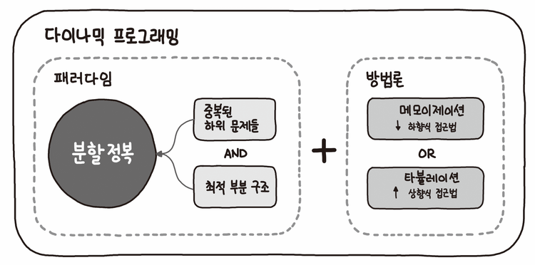
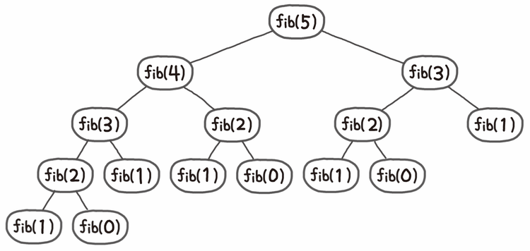

# **Dynamic Programming**

## 0. Index

## 1. 개요

동적 계획법(Dynamic programming)은 특정 범위까지의 값을 구하기 위해서 그것과 다른 범위까지의 값을 이용하여 효율적으로 값을 구하는 알고리즘 설계 기법이다.

그렇기에 엄밀하게 동적 계획법은 알고리즘보단 문제해결 방법 중 하나의 가까우며 **"어떤 문제를 풀기 위해 그 문제를 더 작은 문제의 연장선으로 생각하고, 과거에 구한 해를 활용하는 방식"** 의 알고리즘을 총칭한다.

## 2. 구현

동적 계획법의 접근 방식은 기본적으로 분할 정복 알고리즘과 유사하다.
두 방식의 차이점은 부분 문제를 나눌 때 생기는데 동적 계획법에 경우 다음과 같다.

1. 부분 문제를 최대한 많이 이용하도록 나눈다.
2. 주어진 부분 문제의 정답을 한 번만 계산하고 저장한다.
3. 추후 다시 한 번 이 부분 문제를 이용할 때는 저장해둔 정답을 바로 산출하여 이용한다.



위 그림처럼 최적 부분 구조를 지닌 중복된 하위 문제들을 분할 정복으로 푸는 문제해결 방법이라고 설명할 수 있다.

> 최적 부분 구조(Optimal Substructure)
>
> 그리디 알고리즘의 일종으로 문제의 최적 해결 방법은 부분 문제에 대한 최적 해결 방법으로 구성되는 구조이다.
> [이곳](https://namu.wiki/w/%EA%B7%B8%EB%A6%AC%EB%94%94%20%EC%95%8C%EA%B3%A0%EB%A6%AC%EC%A6%98#s-2.1)에 있는 서울에서 부산까지 가는 최소 거리 구하는 방법을 확인하면 이해가 편하다.

## 3. 메모이제이션(Memoization)

메모이제이션은 동일한 계산을 반복해야 할 때, 한 번 계산한 결과를 메모리에 저장하고 꺼내씀으로 중복 계산을 방지하는 기법을 말한다.
특별히 동적 계획법의 핵심이 되는 기법으로 메모리라는 공간 비용을 투자해 계산에 소요되는 시간 비용을 줄이는 것을 의미한다.
상향식 접근이냐 하향식 접근이냐에 따라 크게 메모이제이션과 타불레이션으로 나누는데 이 챕터에선 설명만 하고 다음 챕터에서 예시로 코드까지 작성할 예정이다.

### 3.1 메모이제이션(Memoization)

처음 계산하는 값이라면 계산을 하여 저장하고 만약 전에 연산한 계산이라면 다시 계산하지 않고 저장해둔 값을 가져와 사용하는 방식이다.
말 그대로 한 번 계산한 값들을 memo하여 다시 사용하는 것이다.

### 3.2 타뷸레이션(Tabulation)

메모이제이션과 비슷하지만 타뷸리레이션은 값을 미리 계산한다. 즉, 메모이제이션은 값이 필요해질 때, 계산하지만 타뷸레이션은 필요하지 않은 값도 미리 계산하는 것이다.

## 4. 피보나치 수열로 보는 예시

### 4.1 재귀함수 형태

```python
def fibonacci(num: int):
	if num <= 1:
		return 1
	return fibonacci(num - 1) + fibonacci(num - 2)
```

재귀는 쉽게 구현할 수 있지만 함수의 호출이 기하급수적으로 늘어난다는 단점이 있다. 이는 밑의 그림을 보면 알 수 있다.



### 4.2 메모이제이션 형태

```python
fib = {1: 1, 2: 1}

def fibonacci(num: int):
	try:
		return fib[num]
	except:
		fib[num] = fibonacci[num - 1] + fibonacci[num - 2]
		return fib[num]
```

필요한 계산들을 불러오고 아직 계산되지 않은 것이라면 계산하여 저장하고 이미 계산한 것이라면 저장된 결과만 불러온다.

### 4.3 타뷸레이션 형태

```python
fib = [0, 1, 1]

def fib_init(num: int):
	for i in range(3, num + 1):
		fib.append(fib[i - 1] + fib[i - 2])

def fibonacci(num: int):
	return fib[num]
```

```fib_init```을 통해 미리 계산하고 계산한 값을 가져오는 형태이다.

### 4.4 또 다른 형태

```python
def fibonacci(num: int):
	if num <= 2:
		return 1
	past, curr = 1, 1
	for _ in range(num - 2):
		tmp = curr
		curr += past
		past = tmp
	return curr
```

값을 치환하는 방식으로 진행하여 메모리도 아낄 수 있다. 하지만 여러 케이스의 피보나치 수를 구해야 한다면 메모이제이션과 타뷸레이션 형태가 더 효율적이다.

### 5. Python의 경우

python의 경우 메모이제이션을 위한 라이브러리가 존재한다. ```functools.lru_cache```를 사용하면 결과를 저장할 별도의 공간을 만들지 않아도 된다.

```python
from functools import lru_cache


@lru_cache(maxsize=None)
def fibonacci(num: int):
	if num < 2:
		return 1
	return fibonacci(n - 1) + fibonacci(n - 2)
```

### 6. 다양한 동적 계획법

동적 계획법은 앞서 말했듯이 알고리즘이라기 보단 문제 해결 방법에 가깝기 때문에 문제들이 무궁무진하다. 당장의 대표적인 예시들만 해도 다음과 같다.

- [0-1 배낭문제](https://namu.wiki/w/0-1%20%EB%B0%B0%EB%82%AD%20%EB%AC%B8%EC%A0%9C)
- [가장 긴 증가 수열 문제(LIS Problem)](https://namu.wiki/w/%EC%B5%9C%EC%9E%A5%20%EC%A6%9D%EA%B0%80%20%EB%B6%80%EB%B6%84%20%EC%88%98%EC%97%B4)
- [연쇄 행렬 곱셈 문제](https://namu.wiki/w/%EC%97%B0%EC%87%84%20%ED%96%89%EB%A0%AC%20%EA%B3%B1%EC%85%88%20%EC%95%8C%EA%B3%A0%EB%A6%AC%EC%A6%98)
- 그래프 상의 최단 거리 문제
  - [벨먼-포드 알고리즘](https://namu.wiki/w/%EB%B2%A8%EB%A8%BC-%ED%8F%AC%EB%93%9C%20%EC%95%8C%EA%B3%A0%EB%A6%AC%EC%A6%98)
  - [플로이드-워셜 알고리즘](https://namu.wiki/w/%ED%94%8C%EB%A1%9C%EC%9D%B4%EB%93%9C-%EC%9B%8C%EC%85%9C%20%EC%95%8C%EA%B3%A0%EB%A6%AC%EC%A6%98)

  > [다익스트라 알고리즘](https://namu.wiki/w/%EB%8B%A4%EC%9D%B5%EC%8A%A4%ED%8A%B8%EB%9D%BC%20%EC%95%8C%EA%B3%A0%EB%A6%AC%EC%A6%98)은 일종의 BFS이다.
  >

이외에도 다양한 문제들이 있기에 문제에 대한 해답을 찾아가는 것만이 답이다.

## 참고 문헌

- [나무위키, 메모이제이션](https://namu.wiki/w/%EB%A9%94%EB%AA%A8%EC%9D%B4%EC%A0%9C%EC%9D%B4%EC%85%98)
- [나무위키, 동적 계획법](https://namu.wiki/w/%EB%8F%99%EC%A0%81%20%EA%B3%84%ED%9A%8D%EB%B2%95)
- [안경잡이개발자, 파이썬에서 lru_cache를 이용해 함수의 결과를 캐싱(caching)해보자!](https://ndb796.tistory.com/596)
